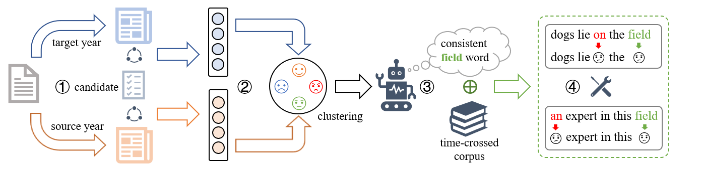
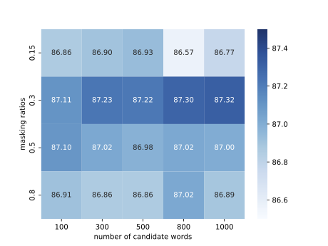

## Improving Temporal Generalization of Pre-trained Language Models with Lexical Semantic Change

This repository contains the code and pre-trained models for our paper [Improving Temporal Generalization of Pre-trained Language Models with Lexical Semantic Change](https://github.com/noise-learning/SelfMix/blob/main)
https://github.com/warrier98/temporal_adaptation/blob/main/LMLM


## Quick Links

- [Overview](https://github.com/warrier98/temporal_adaptation/blob/main/LMLM#Overview)
- Datasets
- Baseline
- Train
  - [Requirements]()
  - [Candidate Words Selection]()
  - [Representation and Clustering]()
  - Train LMLM
  - Finetuning
- [Results](https://github.com/noise-learning/SelfMix#results)


## Overview

We proposes **LMLM**, i.e., a simple yet effective **lexical-level masking strategy** to post-train the pre-trained models.

We investigate the temporal misalignment of the PLMs from the lexical level and observe that the words with salient lexical semantic change contribute significantly to the temporal problems. 




## Datasets

The PLM is adapted to temporality using unlabelled data, fine-tuned with the downstream labeled data, and then evaluated with the testing data which has the same time as the pre-training data. We conduct experiments by employing the pre-trained model implemented with the Hugging-Face [transformers](https://huggingface.co/models) package.

We choose the ARXIV dataset for the scientific domain and [Reddit Time Corpus (RTC) dataset](https://github.com/paul-rottger/temporal-adaptation) for the political domain.
We also turn to two different datasets with a similar distribution for pre-training and fine-tuning, respectively. Specifically, we select [WMT News Crawl (WMT)](https://data.statmt.org/news-crawl/) dataset, which contains news covering various topics, e.g., finance, politics, etc, as unlabeled data and [PoliAff ](https://github.com/Kel-Lu/time-waits-for-no-one)dataset  in politic domain as labeled data.

Please download the dataset from their website and put them into the `\data\ ` path.


## Baseline

| Methods | Source Method Link                                           |
| ------- | ------------------------------------------------------------ |
| TADA    | [Röttger and Pierrehumbert, 2021](https://arxiv.org/pdf/2104.08116.pdf) |
| PERL    | [Ben-David et al, 2020](https://direct.mit.edu/tacl/article/doi/10.1162/tacl_a_00328/96489) |
| DILBERT | [Lekhtman et al, 2021](https://aclanthology.org/2021.emnlp-main.20/) |


## Train

### Requirements

You should run the following script to install the remaining dependencies first.

```bash
pip install -r requirements.txt
```


This section introduce the lexical semantic change detection process

### Candidate Words Selection

```python
python src/important_word.py
```

### Representation and Clustering

```python
python src/main_extract.py
```

### Semantic Change Quantification

```python
python src/jsd.py
```


This section introduce how to post-pretrain the lexical-based Masked Language Model (LMLM) objective and finetune them inteo the downstream task: 

### Train LMLM

Train LMLM using `run_mlm.py`. This script is similar to Hugging Face's language modeling training script ([link](https://github.com/huggingface/transformers/tree/master/examples/pytorch/language-modeling)), and introduces three new arguments: `pivot_file`,  `mlm_prob` and `pivot_num` which can used to set a custom probability for semantic masking.


```bash
bash sh/run_mlm.sh
```

```bash
python run_mlm.py \
    --model_name_or_path bert-base-uncased \
    --train_file  \
    --validation_file  \
    --per_device_train_batch_size 64 \
    --per_device_eval_batch_size 64 \
    --line_by_line \
    --do_train \
    --do_eval \
    --num_train_epochs 5 \
    --pivot_file data/arxiv/arxiv_word/jsd_09_21.txt \
    --mlm_prob ${mlm_prob} \
    --pivot_num ${pivot_num} \
    --max_seq_length 128 \
    --overwrite_output_dir \
    --save_steps 100000 \
    --output_dir saved_models/mlm_model/poliaff16-${mlm_prob}-${pivot_num}-mlm-${gpu_num}gpu
```


### Finetuing

For finetuning the LMLM or pre-trained model,  we use the same scripts with Hugging Face's language modeling. **Especially, we average five random seeds as our final results**:

```
bash sh/finetuning.sh
```

```bash
seed_list=(5 10 15 20 42)
for loop in $(seq 0 4); do
  python finetuning.py \
    --model_name_or_path saved_models/mlm_model/poliaff${year}-${mlm_prob}-${pivot_num}-mlm-${gpu_num}gpu \
    --train_file data/poliaff/train/20${year}.csv \
    --validation_file data/poliaff/test/2017.csv \
    --do_train \
    --do_eval \
    --seed ${seed_list[${loop}]} \
    --per_device_eval_batch_size 128 \
    --per_device_train_batch_size 128 \
    --output_dir saved_models/finetuning_model/-${mlm_prob}-${pivot_num}-${year}-17-${gpu_num}gpu/${seed_list[$loop]} \
    --output saved_models/finetuning_model/arxiv-${mlm_prob}-${pivot_num}-${year}-17-${gpu_num}gpu/${seed_list[$loop]} \
    --overwrite_output_dir \
    --save_steps 100000 \
    --num_train_epochs 5 \
    --max_seq_length 128 \
    --use_special_tokens
done
```


## Results

Here we list our results of different masking strategies of LMLM in Arxiv datasets. More information about experiment details and results can be seen in our paper.




